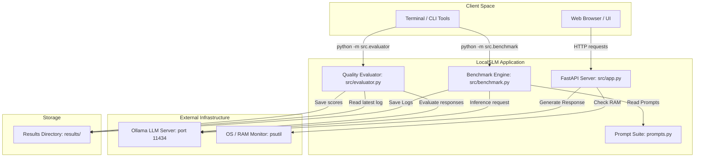
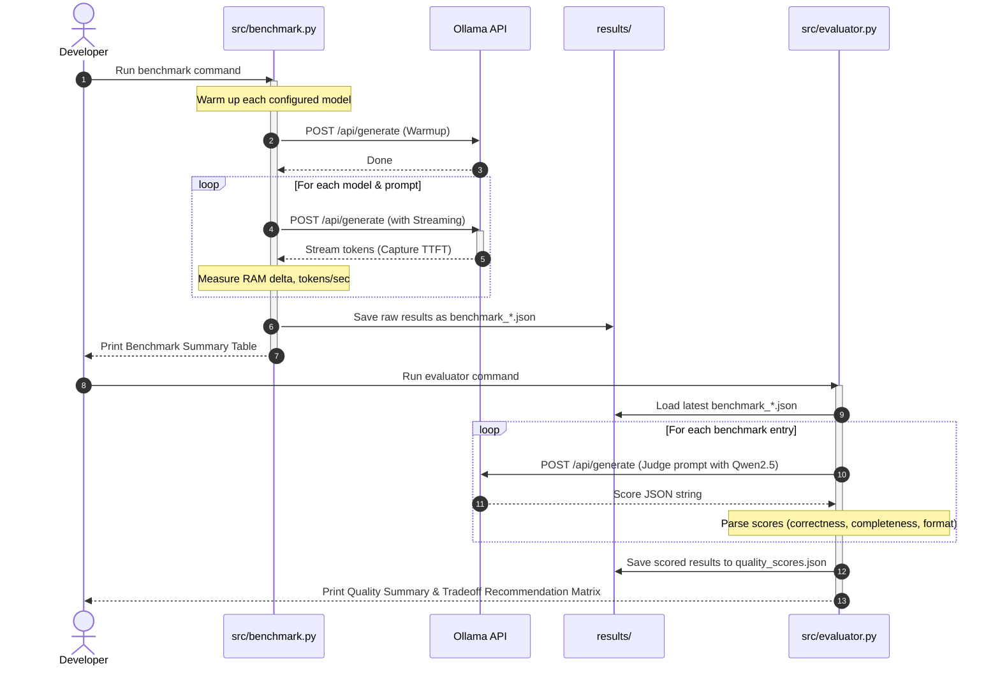

# LocalSLM ⚡

[](https://www.python.org/)
[](https://fastapi.tiangolo.com/)
[](https://ollama.com/)
[](#license)

LocalSLM is an offline Small Language Model (SLM) orchestration, evaluation, and latency-tracking dashboard. It provides a FastAPI backend server for model inference (both synchronous and streaming), real-time hardware profiling (RAM tracking, TTFT, generation speed), a browser-based UI, and an offline LLM-as-judge benchmarking and evaluation suite.

LocalSLM is designed to operate 100% locally and privately, requiring zero external API keys and incurring zero runtime costs.

---

## Table of Contents

1. [Project Overview](#project-overview)
2. [Key Features](#key-features)
3. [Tech Stack](#tech-stack)
4. [Project Structure](#project-structure)
5. [Architecture & Flow](#architecture--flow)
6. [Prerequisites](#prerequisites)
7. [Installation & Setup](#installation--setup)
8. [Usage](#usage)
   - [Running the FastAPI Server](#running-the-fastapi-server)
   - [Interactive Web UI](#interactive-web-ui)
   - [CLI Benchmarking](#cli-benchmarking)
   - [LLM-as-Judge Evaluation](#llm-as-judge-evaluation)
9. [API Documentation](#api-documentation)
10. [Development & Code Quality](#development--code-quality)
11. [Testing](#testing)
12. [Configuration](#configuration)
13. [Troubleshooting & Common Issues](#troubleshooting--common-issues)
14. [Contributing](#contributing)
15. [License](#license)

---

## Project Overview

### What the project is
LocalSLM is a specialized development and profiling environment for lightweight open-source language models (such as `llama3.2:3b`, `gemma2:2b`, and `qwen2.5:3b`). It acts as an orchestrator layer on top of Ollama, exposing enhanced latency-tracking metrics and allowing rapid evaluation of SLM trade-offs.

### The problem it solves
Deploying large language models is costly, complex, and raises privacy concerns. Developers are increasingly turning to Small Language Models (SLMs) that run locally. However, choosing the right SLM is challenging:
* Which model is fastest on your specific hardware?
* Which model produces the most accurate and properly formatted answers for your task types?
* How does the models' RAM footprint fluctuate during inference?

LocalSLM answers these questions by profiling execution times, system memory footprints, and generation speeds, while using an offline LLM-as-judge to score answers objectively on correctness, completeness, and formatting.

---

## Key Features

* **Multi-Model Orchestration**: Standardized endpoints for local models (`llama3.2:3b`, `gemma2:2b`, and `qwen2.5:3b`) with seamless switching.
* **Granular Performance Profiling**: Captures Time To First Token (TTFT), total generation time, tokens per second, and RAM consumption delta using `psutil`.
* **Streaming & Server-Sent Events (SSE)**: Built-in streaming endpoint `/generate/stream` yielding tokens and intermediate metrics in real-time.
* **Interactive Web Playground**: Minimalist, responsive retro-dark browser interface available at `/ui` for live model comparison.
* **30-Prompt Benchmark Suite**: Structured test cases in `prompts.py` spanning Easy, Medium, and Hard difficulties across factual, reasoning, summarization, code generation, and JSON extraction tasks.
* **Offline LLM-as-Judge Evaluator**: A scoring pipeline using `qwen2.5:3b` to objectively evaluate model responses (0.0 to 1.0) and export reports.
* **Multidimensional Recommendations**: Renders a speed-versus-quality Tradeoff Recommendation Matrix to identify the best model for latency-critical or accuracy-critical applications.

---

## Tech Stack

* **Programming Language**: Python (Version 3.10+)
* **API Framework**: FastAPI (Asynchronous HTTP server)
* **ASGI Server**: Uvicorn
* **HTTP Client**: Requests (with chunked stream parsing)
* **System Monitoring**: psutil (System memory profiling)
* **Console UI Rendering**: Rich (Format logs, rules, progress, and terminal summary tables)
* **Local Inference Engine**: Ollama (Offline API server running at `http://localhost:11434`)

---

## Project Structure

The project has a clean, focused file hierarchy:

```text
localslm/
├── results/                     # Artifacts directory for benchmark logs
│   ├── benchmark_*.json         # Timestamped raw performance logs
│   └── quality_scores.json      # Output scores from LLM-as-judge evaluator
├── src/                         # Python source files
│   ├── __init__.py              # Package initialization
│   ├── app.py                   # FastAPI server, SSE stream, and static Web UI
│   ├── benchmark.py             # Performance measurement engine (CLI)
│   └── evaluator.py             # LLM-as-judge quality scoring pipeline (CLI)
├── .gitignore                   # Ignore virtual environments, caches, and raw images
├── prompts.py                   # 30 standard prompt definitions categorized by task and difficulty
└── README.md                    # Project documentation (this file)
```

### Module Responsibilities

* **`src/app.py`**: Declares FastAPI endpoints and configures endpoints connecting to Ollama. It wraps Ollama's API responses, computes latency breakdowns, tracks system memory states, and renders the static Single Page Application (SPA) dashboard.
* **`src/benchmark.py`**: Executes the warmup phase and coordinates the automated evaluation of models against prompts. Generates a Rich summary table displaying p50 and p95 TTFT metrics, processing speeds, and RAM changes.
* **`src/evaluator.py`**: Runs an offline judge agent on the latest benchmark JSON. Instructs the judge model to parse and validate outputs, score them, write the unified scores report, and generate a recommended model tradeoff matrix.
* **`prompts.py`**: Central repository of curated test prompts. Covers 5 task domains: Factual, Reasoning, Summarization, Code, and Structured output.

---

## Architecture & Flow

### Component Interaction Diagram

This diagram shows how LocalSLM's server, CLI applications, and local hardware resources coordinate with the underlying Ollama daemon.



### Benchmarking & Evaluation Pipeline Flow

This sequence shows the end-to-end benchmarking lifecycle, from prompt generation and performance metric gathering to LLM-as-judge scoring.



---

## Prerequisites

To run LocalSLM, your system must have:

1. **Python**: Version `3.10` or higher (successfully tested and validated on `3.12.13`).
2. **Ollama**: Download and install Ollama for your OS from [ollama.com](https://ollama.com/).
3. **Required Ollama Models**: Pull the target models before running the pipeline:
   ```bash
   ollama pull llama3.2:3b
   ollama pull gemma2:2b
   ollama pull qwen2.5:3b
   ```
4. **Hardware Considerations**: Operating three concurrent models and a judge model requires at least 8GB-16GB of system RAM for optimal offline inference performance.

---

## Installation & Setup

Follow these step-by-step instructions to configure your local development environment:

### 1. Clone the Repository
Navigate to your project directory:
```bash
git clone <repository-url>
cd localslm
```

### 2. Set Up a Python Virtual Environment
We recommend using a clean virtual environment:
```bash
# Create the virtual environment
python3 -m venv .venv

# Activate the virtual environment
# On macOS/Linux:
source .venv/bin/activate
# On Windows:
.venv\Scripts\activate
```

### 3. Install Dependencies
Install all package dependencies via `pip`:
```bash
pip install fastapi uvicorn pydantic psutil requests rich
```

### 4. Ensure Ollama is Running
Start the local Ollama daemon. By default, Ollama binds to `http://localhost:11434`.
Verify your setup is responsive by running:
```bash
curl -s http://localhost:11434/api/tags
```
*(Ensure all models listed in the [Prerequisites](#prerequisites) section appear in the output.)*

---

## Usage

LocalSLM offers both programmatic HTTP endpoints and command-line interfaces for measuring performance.

### Running the FastAPI Server

Launch the web backend using Uvicorn:
```bash
uvicorn src.app:app --reload --port 8000
```
This boots up the server on port `8000`. You can visit the API documentation or playground at the following URLs:
* **Interactive UI Playground**: [http://localhost:8000/ui](http://localhost:8000/ui)
* **FastAPI OpenAPI Documentation**: [http://localhost:8000/docs](http://localhost:8000/docs)
* **FastAPI Alternate Redoc Docs**: [http://localhost:8000/redoc](http://localhost:8000/redoc)

---

### Interactive Web UI

The built-in single-page browser application allows you to:
1. Select a model from the configured models (`llama3.2:3b`, `gemma2:2b`, or `qwen2.5:3b`).
2. Adjust `Max tokens` (defaults to `512`).
3. Compose and submit a custom prompt.
4. View responses rendered in markdown-style block format alongside performance metrics (TTFT, Total Time, Tokens/sec, Total Tokens generated).

You can run queries quickly with standard mouse clicks, or submit prompts using the `Ctrl + Enter` keyboard shortcut.

---

### CLI Benchmarking

Run the built-in benchmark script to profile inference speed and memory footprint over a range of prompts:
```bash
python -m src.benchmark
```

By default, executing the script runs a **quick-mode sample** (the first 5 prompts out of the 30 available in `prompts.py`) to avoid unnecessary wait times. It performs:
1. A quick throwaway warmup prompt to ensure the active model is resident in CPU/GPU memory.
2. Sequential generation of the prompts.
3. Collection of latency, token velocity, and RAM differences.
4. Safe persistence of the results into `results/benchmark_YYYYMMDD_HHMMSS.json`.
5. Display of a beautiful terminal-based comparison matrix:

```text
                               Benchmark Summary
┏━━━━━━━━━━━━━┳━━━━━━━━━━━━━━┳━━━━━━━━━━━━━━┳━━━━━━━━━━━━━┳━━━━━━━━━━━━━━━┳━━━━━━━━━┓
┃ Model       ┃  TTFT p50 ms ┃  TTFT p95 ms ┃  Tok/s avg  ┃  RAM delta MB ┃ Prompts ┃
┡━━━━━━━━━━━━━╇━━━━━━━━━━━━━━╇━━━━━━━━━━━━━━╇━━━━━━━━━━━━━╇━━━━━━━━━━━━━━━╇━━━━━━━━━┩
│ llama3.2:3b │        412.3 │        430.2 │        38.4 │          15.2 │       5 │
│ gemma2:2b   │        385.1 │        401.4 │        42.1 │          12.8 │       5 │
│ qwen2.5:3b  │        295.6 │        310.1 │        48.2 │           8.4 │       5 │
└─────────────┴──────────────┴──────────────┴─────────────┴───────────────┴─────────┘
```

*Note: To run a comprehensive full-prompt suite, you can temporarily edit `src/benchmark.py` or modify the script's `sample` parameter.*

---

### LLM-as-Judge Evaluation

Once a raw benchmark log is saved under `results/`, you can measure generation quality by initiating the LLM-as-judge pipeline:
```bash
python -m src.evaluator
```

The evaluator will automatically:
1. Load the most recent `benchmark_*.json` log file.
2. Use the fast, instructions-following **`qwen2.5:3b`** model as an objective grader.
3. Prompt the judge to evaluate the correctness, completeness, and structure of each answer on a scale from `0.0` to `1.0`.
4. Export the scored results to `results/quality_scores.json`.
5. Output two console components:
   * **Quality Scores Table**: Grids displaying average dimensions of correctness, completeness, and structure.
   * **Tradeoff Matrix**: Maps generation speeds side-by-side with accuracy scores to issue optimal use-case verdicts:

```text
======================= Tradeoff Matrix =======================
Model                Tok/s    Quality   Verdict
────────────────────────────────────────────────────────────
  llama3.2:3b         38.4      0.825   ⚖️  Balanced
  gemma2:2b           42.1      0.790   ⚡ Fastest
  qwen2.5:3b          48.2      0.875   🎯 Best quality
```

---

## API Documentation

FastAPI exposes JSON-REST endpoints at `http://localhost:8000`. Below are explanations of the core programmatic interfaces:

### 1. `GET /`
Retrieves service name, standard models configured, and active endpoints.
* **Response Example**:
  ```json
  {
    "service": "LocalSLM",
    "models": ["llama3.2:3b", "gemma2:2b", "qwen2.5:3b"],
    "endpoints": ["/generate", "/generate/stream", "/models", "/health", "/ui"]
  }
  ```

### 2. `GET /health`
Returns connection status to the local Ollama daemon, alongside total and currently utilized host RAM.
* **Response Example**:
  ```json
  {
    "status": "ok",
    "ollama": true,
    "ram_used_gb": 6.84,
    "ram_total_gb": 16.0
  }
  ```

### 3. `GET /models`
Retrieves both list of models configured in LocalSLM (`configured`) and models actually installed locally in Ollama (`available`).
* **Response Example**:
  ```json
  {
    "configured": ["llama3.2:3b", "gemma2:2b", "qwen2.5:3b"],
    "available": ["llama3.2:3b", "gemma2:2b", "qwen2.5:3b"]
  }
  ```

### 4. `POST /generate`
Standard non-streaming generation endpoint. Computes granular metrics such as time-to-first-token (TTFT) and resident RAM changes.
* **Payload Format**:
  ```json
  {
    "prompt": "Explain the CAP theorem in one sentence.",
    "model": "qwen2.5:3b",
    "max_tokens": 128,
    "temperature": 0.1
  }
  ```
* **Response Example**:
  ```json
  {
    "model": "qwen2.5:3b",
    "response": "The CAP theorem states that a distributed data store can simultaneously provide at most two of three guarantees: Consistency, Availability, and Partition tolerance.",
    "latency": {
      "ttft_ms": 295.4,
      "total_ms": 1210.1,
      "tokens_per_sec": 41.3,
      "token_count": 50,
      "ram_delta_mb": 4.1
    }
  }
  ```

### 5. `POST /generate/stream`
Streaming generation endpoint. Returns output via **Server-Sent Events (SSE)** (`text/event-stream`).
* **Chunk format**:
  - *Metadata Header (sent once on first token response)*: `data: {"ttft_ms": 290.1}`
  - *Token body chunks (sent sequentially)*: `data: {"token": "hello"}`
  - *Final metadata (sent once at termination)*: `data: {"done": true, "total_ms": 1150.0, "token_count": 50}`

---

## Development & Code Quality

If you are modifying the codebase, adhere to these guidelines:

### Virtual Environment Hygiene
Keep your dependencies clean and isolated. Do not commit `.venv/` or caching folders to git. They are already listed in `.gitignore`.

### Code Quality Checklist
Before submitting a pull request:
1. **No Lint Warnings**: Follow PEP-8 styling standards.
2. **Compile-Check Syntax**: Verify that modifications have not broken standard Python grammar:
   ```bash
   python3 -m py_compile src/*.py prompts.py
   ```
3. **Prevent Hardcoding**: If adding features, try to make endpoints or paths configurable or reuse existing variables in `src/app.py` or `src/benchmark.py`.

---

## Testing

### Manual Testing
As there are currently no automated unit testing suites (like `pytest`) set up in this repository, manual endpoint verification is standard practice.

To test your API changes manually:
1. Boot the server: `uvicorn src.app:app --port 8000`.
2. Navigate to [http://localhost:8000/docs](http://localhost:8000/docs) and trigger individual test cases via the Swagger UI.
3. Ensure no runtime exceptions are raised on the server terminal output.

### CI-style Checks
Always run the validation compiler check as part of your development workflow:
```bash
python3 -m py_compile src/app.py src/benchmark.py src/evaluator.py prompts.py
```

---

## Build & Deployment

Since LocalSLM is designed to operate on lightweight hardware in local environments, there is no separate production build script (e.g., webpack, pyinstaller) required.

### Production/Self-Hosted Best Practices
To self-host the server for multiple users in a local network or lab:
1. **Bind to Host Network**: Run Uvicorn binding to all network interfaces (`0.0.0.0` instead of `localhost`):
   ```bash
   uvicorn src.app:app --host 0.0.0.0 --port 8000
   ```
2. **Process Manager**: Use standard process managers like `systemd` (on Linux) or `pm2` to auto-restart the application if the server crashes or the system reboots.
3. **Reverse Proxying**: Set up an NGINX reverse proxy block in front of port `8000` to support HTTPS encryption.

---

## Configuration

All system configurations are currently managed via static declarations at the top of their respective source files. Below is a breakdown of the active settings:

| Configuration Variable | File | Default Value | Description |
| :--- | :--- | :--- | :--- |
| `OLLAMA_URL` | `src/app.py`, `src/benchmark.py`, `src/evaluator.py` | `"http://localhost:11434"` | Port and address of the running local Ollama engine daemon. |
| `MODELS` | `src/app.py`, `src/benchmark.py` | `["llama3.2:3b", "gemma2:2b", "qwen2.5:3b"]` | Configured models available for evaluation. |
| `RESULTS_DIR` | `src/benchmark.py`, `src/evaluator.py` | `"results"` | Destination directory for raw and parsed JSON files. |
| `JUDGE_MODEL` | `src/evaluator.py` | `"qwen2.5:3b"` | Model used as the LLM-as-judge evaluator. |

To change any setting (e.g., pointing to an external Ollama instance on a remote server), edit the respective Python variable.

---

## Troubleshooting & Common Issues

### 1. "Ollama connection failed" / `degraded` health status
* **Inference**: The FastAPI server shows `degraded` health and endpoints throw errors.
* **Root Cause**: Ollama is not running, or is listening on a different port.
* **Resolution**: Ensure Ollama is running. Open your browser to `http://localhost:11434` to verify. If Ollama runs on a different port, update the `OLLAMA_URL` variable across the source files.

### 2. "Model not found" or HTTP 400 bad requests
* **Inference**: Endpoint responds with `Model '...' not available`.
* **Root Cause**: The model is configured in the code but has not been downloaded in Ollama.
* **Resolution**: Run `ollama pull <model-name>` in your terminal. For example:
  ```bash
  ollama pull llama3.2:3b
  ```

### 3. "High memory usage / system slowdown"
* **Inference**: Computer freezes or slows down during evaluation.
* **Root Cause**: Concurrent loading of multiple models.
* **Resolution**: Keep `temperature` low and limit `max_tokens` to `256` or lower to prevent excessive CPU/GPU calculation overhead. Close heavy applications to free up RAM.

### 4. JSON decoding errors during LLM-as-judge grading
* **Inference**: The terminal logs `Judge error` during evaluation.
* **Root Cause**: The judge model did not return output matching the requested JSON pattern `{ "correctness": ..., "completeness": ..., "format": ... }`.
* **Resolution**: Ensure `qwen2.5:3b` is pulled and used. Qwen 2.5 has excellent instruction-following capabilities that make it well-suited for structured JSON output formatting.

---

## Contributing

We welcome contributions to LocalSLM! To contribute:

1. **Format your code**: Ensure all Python files adhere to standard PEP-8 style guidelines.
2. **Validate Syntax**: Run compiler tests:
   ```bash
   python3 -m py_compile src/*.py prompts.py
   ```
3. **Test Manually**: Launch Uvicorn and confirm that both `/generate` and `/generate/stream` operate without errors.
4. **Submit PR**: Open a pull request with a descriptive title detailing your additions (e.g., "Add support for custom system prompts" or "Introduce new model evaluation suite").

---

## License

No explicit license file exists in this repository. The project is currently unlicensed. Please consult the repository maintainers or owners regarding licensing options or permissions before using the software commercially.
